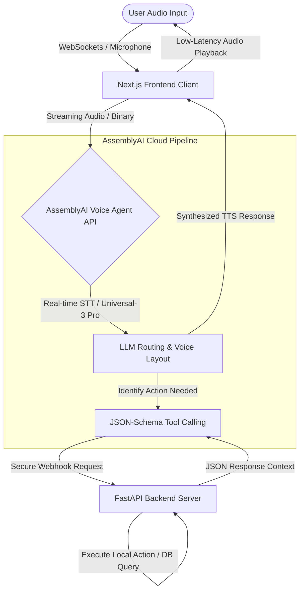

# echologic-voice-agent
An autonomous, real-time voice agent built with AssemblyAI's Voice Agent API, WebSocket streaming, Next.js, and FastAPI for intelligent tool calling.

graph TD
    User([User Audio Input]) -->|WebSockets / Microphone| FE[Next.js Frontend Client]
    FE -->|Streaming Audio / Binary| AAI_API{AssemblyAI Voice Agent API}
    
    subgraph AssemblyAI Pipeline
        AAI_API -->|Real-time STT / Universal-3 Pro| LLM[LLM Routing & Voice Layout]
        LLM -->|Identify Action Needed| ToolsCall[JSON-Schema Tool Calling]
    end

    ToolsCall -->|Secure Webhook Request| BE[FastAPI Backend Server]
    BE -->|Execute Local Action / DB Query| BE
    BE -->|JSON Response Context| ToolsCall
    
    LLM -->|Synthesized TTS Response| FE
    FE -->|Low-Latency Audio Playback| User
    
```
echologic-voice-agent/
├── .github/
│   └── workflows/
│       └── deploy.yml
├── backend/
│   ├── app/
│   │   ├── __init__.py
│   │   ├── main.py
│   │   ├── config.py
│   │   └── tools.py
│   ├── requirements.txt
│   └── Dockerfile
├── frontend/
│   ├── public/
│   ├── src/
│   │   ├── app/
│   │   │   ├── layout.tsx
│   │   │   └── page.tsx
│   │   └── components/
│   │       └── VoiceInterface.tsx
│   ├── package.json
│   ├── next.config.js
│   └── vercel.json
├── .gitignore
└── README.md
```
# EchoLogic AI — Voice Agent Platform 🎙️

An autonomous, low-latency operational voice agent workspace built for field engineers using **AssemblyAI's Voice Agent API**, **Universal-3 Pro Streaming STT**, **FastAPI**, and **Next.js**, deployed effortlessly via **Vercel**.

## System Pipeline Flowchart



---

## Fast-Track First Time Installation

If you are cloning or downloading this repository workspace for the very first time, run our completely automated configuration controller sequence to link your API secrets and install code dependencies across the ecosystem.

```bash
# 1. Give execution clearance permissions to the engine automation file
chmod +x setup.sh

# 2. Run the interactive deployment orchestrator script
./setup.sh
```
*The installer tool will automatically prompt you for your keys and safely write your environment configs across directories without errors.*

---

## Daily Startup Routine (Subsequent Runs)

Once you have completed the automated installation phase using `./setup.sh` above, **do not run the setup routine again.** Simply use the runtime scripts below to initiate the local execution servers immediately:

### Step 1: Fire Up Your Tool Fulfillment Engine (Backend)
Open a fresh root terminal path and launch your Python server environment:
```bash
# Enter backend folder space
cd backend

# Engage your insulated python runtime loop
source venv/bin/activate

# Execute production local hot-reloader 
uvicorn app.main:app --host 0.0.0.0 --port 8000 --reload
```

### Step 2: Fire Up Your Interactive Operator Interface (Frontend)
Open a separate terminal window and launch your UI development workspace:
```bash
# Enter frontend visual project folder space
cd frontend

# Engage local web execution loop
npm run dev
```
Open your secure web space browser interface at `http://localhost:3000` to interact directly with your workspace portal!
